# Croqui Guaicurus

Planejador de distribuição de viaturas, formaturas e croquis sobre imagem de satélite, em **escala real** do terreno. Arquivo único (`croqui_guaricurus.html`), roda offline no navegador, sem instalação. Ao final, exporta uma **imagem de relatório** com mapa e legenda.

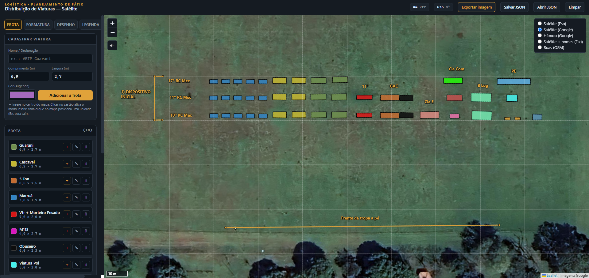
<!-- PRINT 001: janela cheia do app, com viaturas no mapa e o painel lateral na aba "Frota". -->

---

## Vantagens

- **Escala real:** cada viatura mantém o tamanho verdadeiro em qualquer zoom, rotação ou camada.
- **Offline, sem instalar:** um único HTML; internet só para carregar o satélite.
- **Fontes de satélite:** Esri, Google Satélite, Google Híbrido e OpenStreetMap.
- **Edição direta:** clique em viatura, linha ou texto para editar; mova/gire/duplique em grupo.
- **Seleção múltipla:** por área (arrasto) ou `Ctrl+clique`.
- **Croqui:** medição de distância, linhas, textos (com quebra de linha) e grade de orientação em escala real.
- **Relatório em imagem:** cabeçalho (data, centro, zoom, rumo, escala) + mapa + legenda automática.
- **Backup:** salvamento automático no navegador e exportação/importação em `.json`.

## Considerações

- **Use Google Chrome** (ou Edge/Chromium). A exportação usa a captura de tela do navegador.
- A imagem exportada é uma **captura de tela**: a nitidez acompanha a resolução do monitor.
- Imagens de satélite são **ilustrativas**; para uso oficial, considere base licenciada.
- Os **dados ficam no navegador**. Exporte `.json` para backup.

---

## 1. Download e abertura

1. Baixe o `croqui_guaricurus.html`.
2. Dê duplo-clique para abrir no navegador (de preferência Chrome).
3. O app já vem com viaturas de exemplo. Posicione o mapa na sua área (passo 3.1).

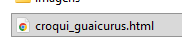
<!-- PRINT 002: o arquivo no explorador ou a aba recém-aberta no navegador. -->

## 2. Interface

Mapa à direita; painel à esquerda, em abas:

| Aba | Função |
|-----|--------|
| **Mapa** | Rumo/rotação e exportar imagem. |
| **Frota** | Cadastrar tipos de viatura e inseri-los. |
| **Formatura** | Criar a zona e preencher automaticamente. Ideal para estimativas ("capacitômetro"). |
| **Desenho** | Medir, linhas, textos, seleção por área e grade. |
| **Legenda** | Tipos, exibir/ocultar e recuperar ocultos. |
| **Dados** | Salvar, exportar e importar `.json`. |

<!-- PRINT 003: recorte da barra de abas do painel. -->

## 3. Passo a passo

### 3.1 Mapa e camada
Arraste para mover, roda do mouse para zoom. No **seletor de camadas** (canto superior direito) escolha a base (Google costuma ser a mais nítida). Para girar, use a aba **Mapa → Rumo** (botão **Norte** volta a 0°).

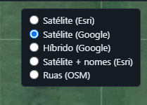
<!-- PRINT 004: seletor de camadas aberto. -->

### 3.2 Cadastrar a frota
Aba **Frota**: preencha **Nome**, **Comprimento** e **Largura**. A **Cor (sugerida)** já vem sorteada entre as ainda não usadas (pode trocar). Clique **Adicionar à frota**. Cada item tem **＋** (inserir no centro), **✎** (editar) e **🗑** (excluir).

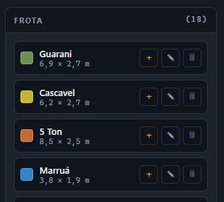
<!-- PRINT 005: aba "Frota" com formulário e lista de tipos. -->

### 3.3 Inserir viaturas
Clique no card do tipo e depois **clique no mapa** em cada ponto (`Esc` sai do modo); ou use **＋** para inserir no centro.

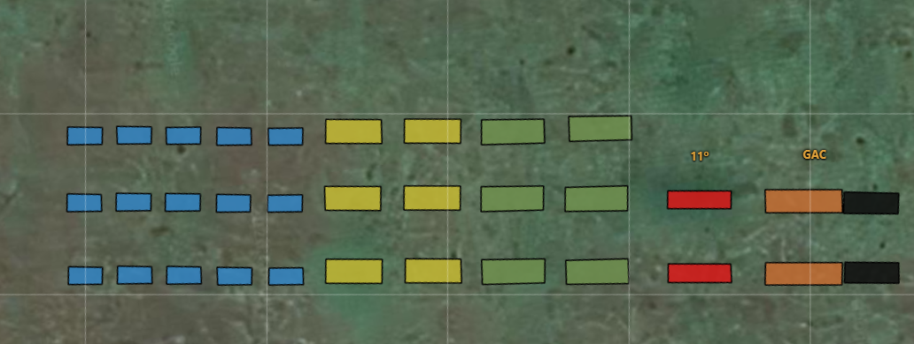
<!-- PRINT 006: viaturas posicionadas em escala real. -->

### 3.4 Selecionar e editar
- **Clique** seleciona; **`Ctrl+clique`** adiciona/remove; **`Shift`+arraste** seleciona por área (ou botão **Selecionar em área**).
- No painel flutuante: editar nome, dimensões, cor e ângulo; girar; duplicar; ocultar; remover. Em grupo, tudo de uma vez.
- **Arraste** para mover; **alça laranja** gira uma viatura.
- **Texto:** edite o conteúdo (Enter quebra linha) e a cor; arraste para reposicionar. **Linha:** edite a cor; arraste os pontos para ajustar.

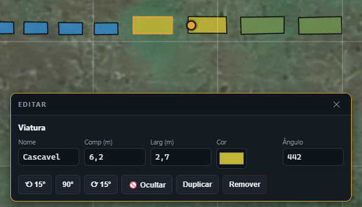
<!-- PRINT 007: viatura selecionada com o painel "Editar". -->

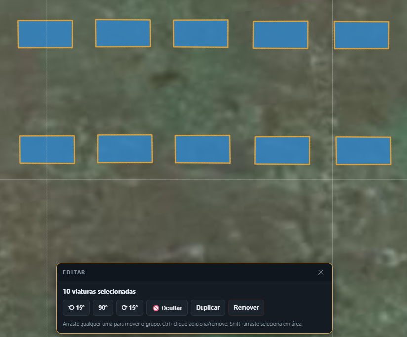
<!-- PRINT 008: retângulo de seleção sobre um grupo de viaturas. -->

### 3.5 Ocultar e reexibir
Use **🚫 Ocultar / 👁 Mostrar** no painel do elemento. Para reexibir, aba **Legenda → Ocultos** (botão **Mostrar** por item, ou **Mostrar todos**). O "olho" 👁 da Legenda oculta um **tipo** inteiro.

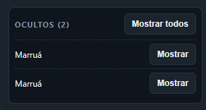
<!-- PRINT 009: seção "Ocultos" na aba Legenda. -->

### 3.6 Zona de formatura
Aba **Formatura**: ajuste **Largura**, **Altura** e **Rumo** (a zona move, gira e redimensiona no mapa). **Estimar** mostra a capacidade; **Preencher** dispõe as viaturas alinhadas ao rumo.

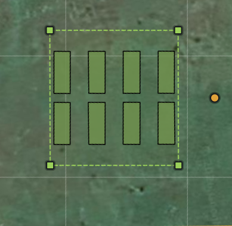
<!-- PRINT 010: zona preenchida automaticamente. -->

### 3.7 Desenhar
Aba **Desenho**: **Medir** (duplo-clique encerra), **Linha**, **Texto** (Enter quebra linha no painel), **Desfazer/Limpar**. Clique num desenho para editá-lo.

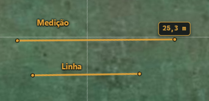
<!-- PRINT 011: medição com rótulo de distância e um texto. -->

### 3.8 Grade de orientação
Aba **Desenho → Grade**: marque **Mostrar grade**, defina **Espaçamento** e **Rumo**, e **Centralizar na vista atual**. Quadrícula em escala real, sai também no relatório.

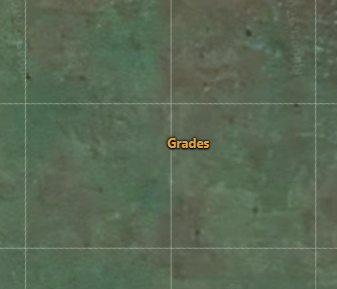
<!-- PRINT 012: grade ativada sobre as viaturas. -->

### 3.9 Exportar a imagem
1. Enquadre a área (zoom/rumo). Prefira camada **Google** para mais nitidez.
2. Clique **Exportar imagem**.
3. Na janela do navegador, escolha **"Esta guia"** e confirme.
4. Baixa o `plano_distribuicao_viaturas.png` com cabeçalho + mapa + legenda. Elementos ocultos não entram.

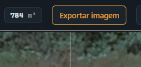
<!-- PRINT 013: janela do Chrome com "Esta guia" selecionada. -->

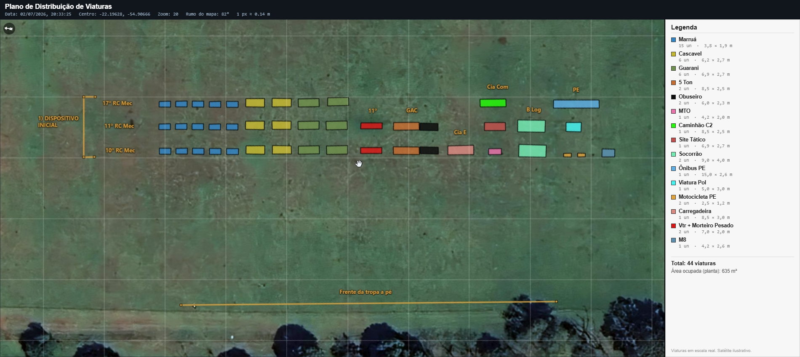
<!-- PRINT 014: imagem final exportada (cabeçalho + mapa + legenda). -->

### 3.10 Salvar / exportar / importar
Salvamento automático no navegador. Aba **Dados**: **Exportar JSON** (backup/transferência) e **Importar JSON** (carrega um projeto).

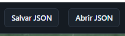
<!-- PRINT 015: aba "Dados" com exportar/importar. -->

---

## Atalhos

| Atalho | Ação |
|--------|------|
| Clique | Selecionar |
| Ctrl + clique | Adicionar/remover da seleção |
| Shift + arraste | Selecionar por área |
| Arraste | Mover (elemento ou grupo) |
| Q / E | Girar 15° |
| Setas / Shift+setas | Ajuste fino / maior |
| Delete | Remover |
| Esc | Sair do modo / limpar seleção |
| Duplo-clique | Encerrar medição/linha |

## FAQ rápido

- **Satélite não aparece:** troque de camada / verifique internet.
- **Imagem cortada ao exportar:** selecione **"Esta guia"** na janela de compartilhamento.
- **Texto sumiu ao ocultar:** aba **Legenda → Ocultos → Mostrar**.
- **Backup:** aba **Dados → Exportar JSON**.
